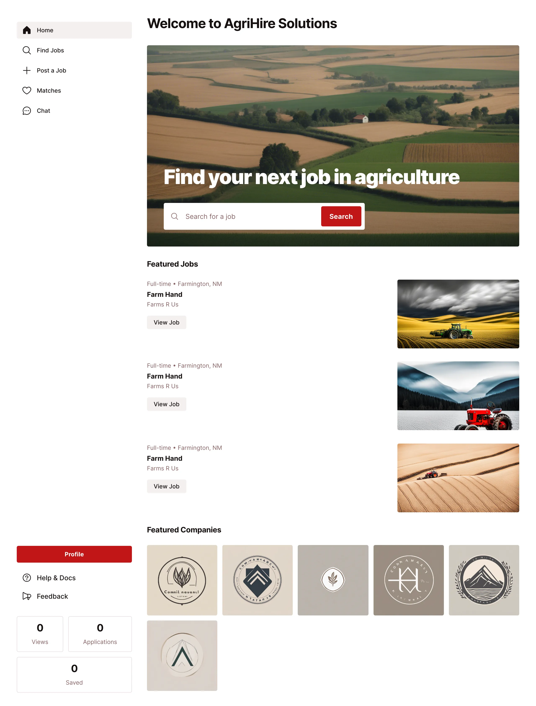
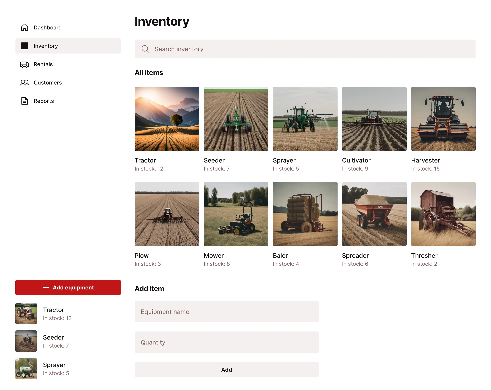
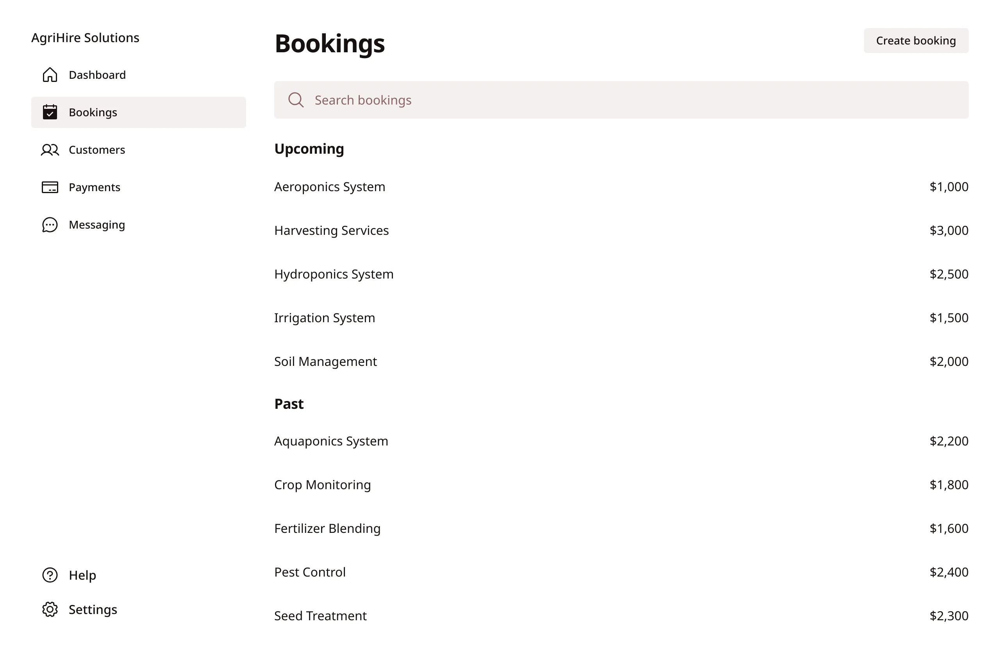
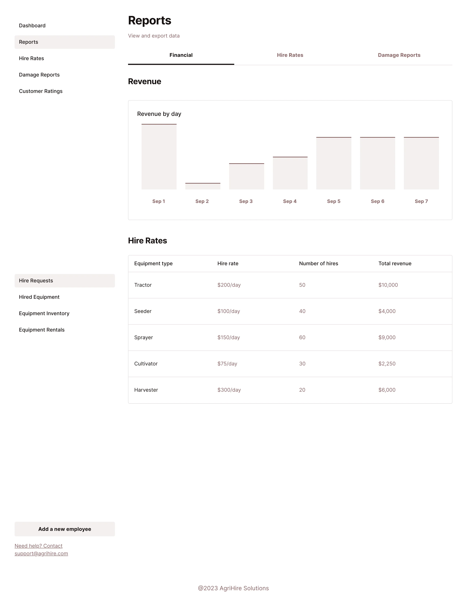
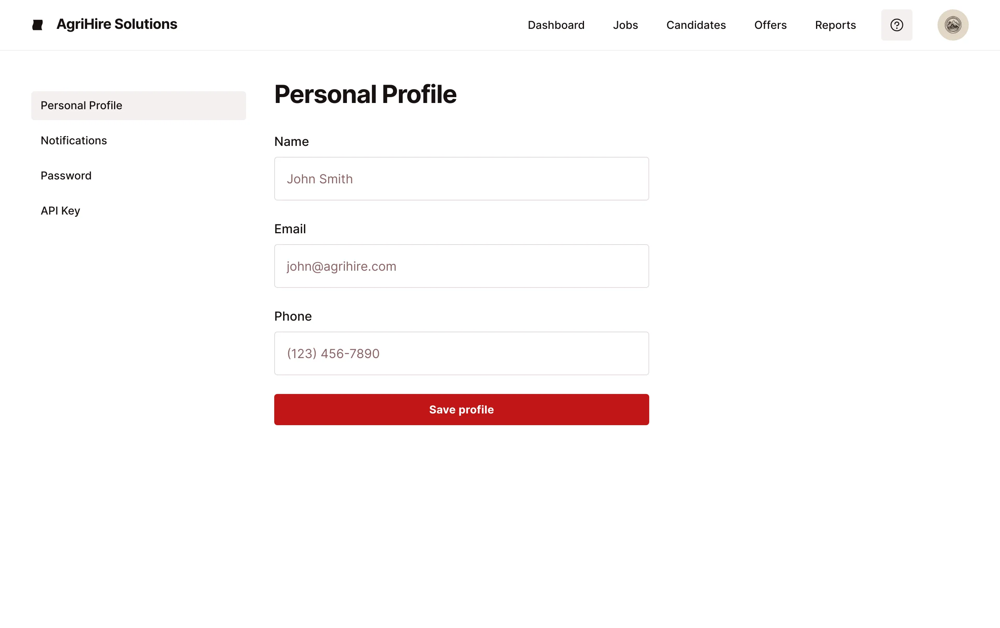
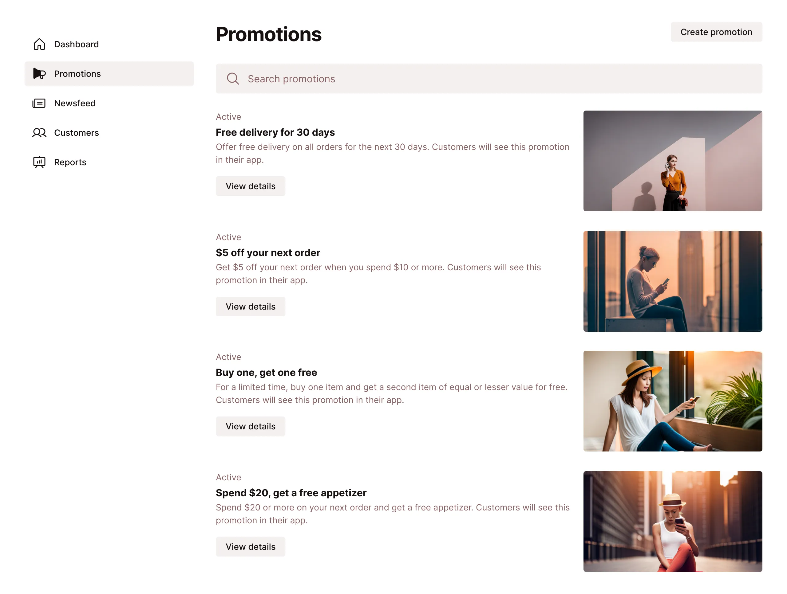
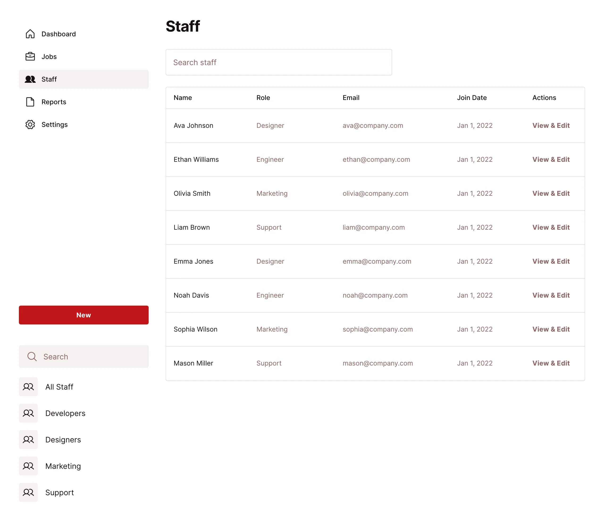
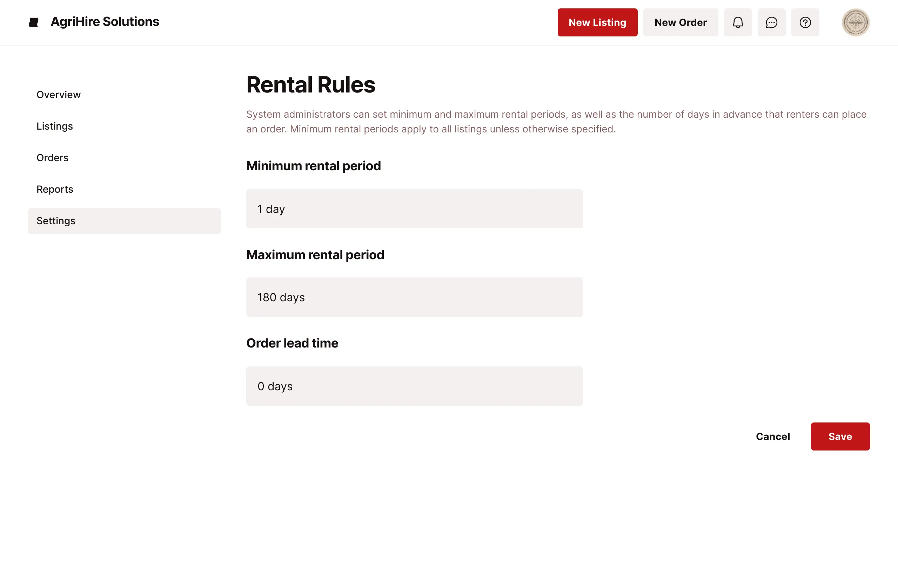
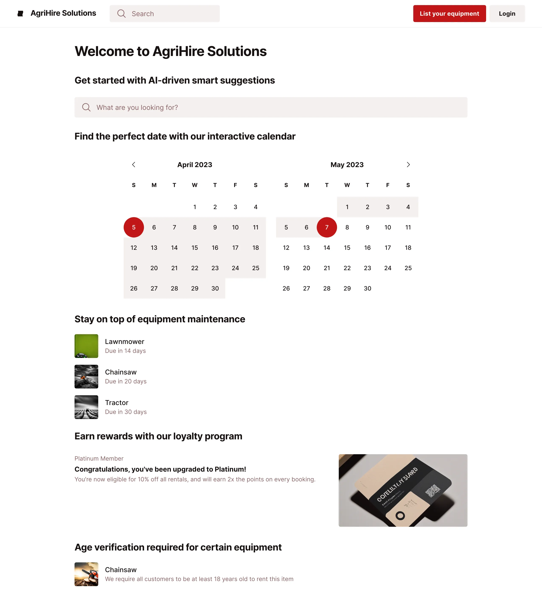

Graphics User Interface (GUI) design is a type of user interface in computer software applications that allows users to interact with electronic devices through graphical icons and visual indicators (such as sub-markers, windows, buttons, and menus) rather than through a textual command line approach.

In this blog post, I will be sharing the GUI design that I have created for a project.

# Dashboard Homepage: 

This page includes a user-friendly product showcase with a carousel of featured machinery, filters by category, and a notification panel for reminders, promotions, and alerts.

# Inventory Section: 

This screen contains a searchable list with photos and specifications of items, options for quick addition and serial number tracking of new equipment, status updates, calendar view for checkout/return tracking, and customer verification.

# Order Management: 

The design features an overview of bookings, a quick access panel for customer records and management, payment processing interface, and a customer messaging section.

# Comprehensive Reporting: 

A reporting screen with accessible financial, hire rates, and damage reports for managers, including data export options.

# Account & Profile Management: 

A screen for staff members to manage their personal profile settings within the account management section.

# Promotions & News Management: 

Tools for managers to create and manage promotions as well as a newsfeed for customer dashboards.

# Staff Oversight & Reporting Analysis: 

A screen for managers to oversee staff profiles and permissions, with advanced reporting and analytics features.

# System Settings: 

Interface for the Systems Administrator to manage categories, shipping prices, and hire period settings.

# Innovation and Accessibility: 

Features AI-driven smart suggestions, an interactive calendar, maintenance alerts, loyalty program, NZD pricing, and age verification.

