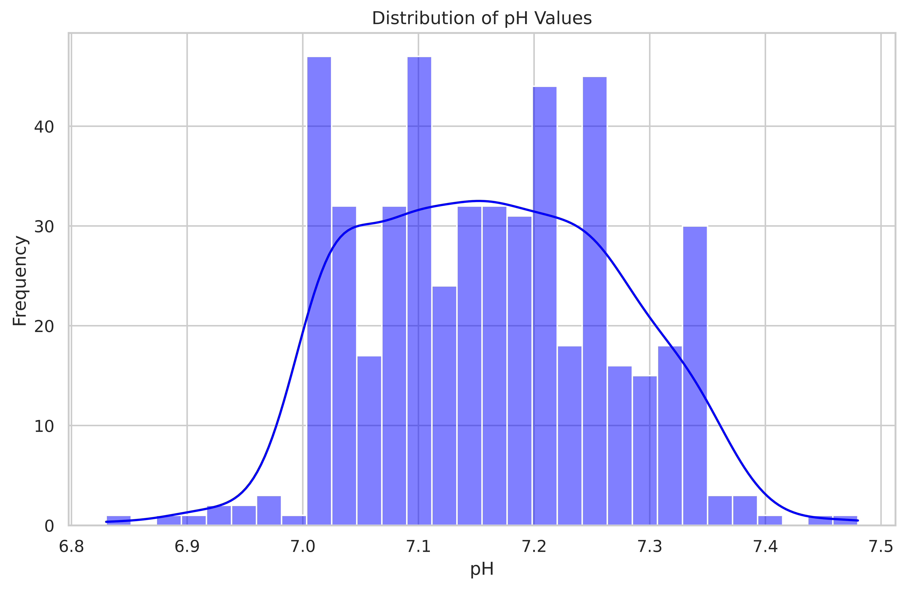
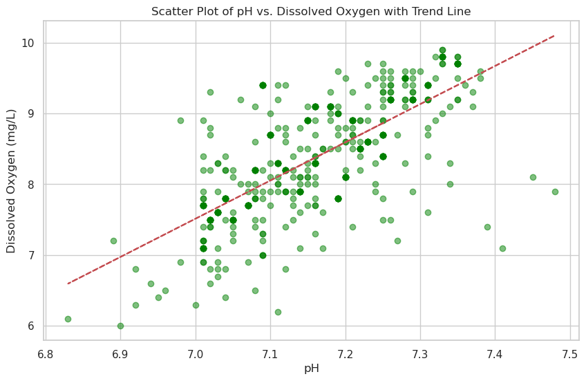

# Water Quality Testing Dataset Summary

The following provides an overview of the water quality testing dataset available from Kaggle, which can be found at this source: [Water Quality Testing Dataset](https://www.kaggle.com/datasets/shreyanshverma27/water-quality-testing).

## Dataset Overview

The dataset comprises 500 individual water samples, each analysed for several quality parameters such as pH, temperature, turbidity, dissolved oxygen, and conductivity. To explore the dataset, Python is employed for data manipulation and visualisation.

### Statistical Summary

```python
import pandas as pd
df = pd.read_csv('Water Quality Testing.csv')
print(df.head())
print(df.describe())
```

The statistical data provided in the table below offers a comprehensive overview of the dataset:

|       | Sample ID | pH      | Temperature (°C) | Turbidity (NTU) | Dissolved Oxygen (mg/L) | Conductivity (µS/cm) |
|-------|-----------|---------|------------------|-----------------|-------------------------|----------------------|
| count | 500.0     | 500.0   | 500.0            | 500.0           | 500.0                   | 500.0                |
| mean  | 250.5     | 7.16114 | 22.0544          | 4.1694          | 8.3822                  | 344.362              |
| std   | 144.48183 | 0.10753 | 0.903123         | 0.397491        | 0.822396                | 13.038672            |
| min   | 1.0       | 6.83    | 20.3             | 3.1             | 6.0                     | 316.0                |
| 25%   | 125.75    | 7.08    | 21.2             | 3.8             | 7.8                     | 333.0                |
| 50%   | 250.5     | 7.16    | 22.2             | 4.2             | 8.4                     | 344.0                |
| 75%   | 375.25    | 7.25    | 22.9             | 4.5             | 9.1                     | 355.0                |
| max   | 500.0     | 7.48    | 23.6             | 5.1             | 9.9                     | 370.0                |


## Visualisation of pH Distribution

The dataset's pH values are visualised using a histogram, highlighting their distribution. The Python code for generating this plot is as follows:

### pH Distribution Plot

```python
import matplotlib.pyplot as plt
import seaborn as sns

# Set the aesthetic style of the plots
sns.set(style='whitegrid')

# Plotting the distribution of pH values
plt.figure(figsize=(10, 6), facecolor='white')
sns.histplot(df['pH'], kde=True, color='blue', bins=30)
plt.title('Distribution of pH Values')
plt.xlabel('pH')
plt.ylabel('Frequency')
plt.show()
```



## Scatter Plot of pH vs Dissolved Oxygen

A scatter plot illustrates the relationship between pH and dissolved oxygen levels, with a trend line indicating the overall trend. The Python code used is:

### Scatter Plot
```python
import numpy as np

# Creating a scatter plot with a trend line
plt.figure(figsize=(10, 6), facecolor='white')
plt.scatter(df['pH'], df['Dissolved Oxygen (mg/L)'], color='green', alpha=0.5)

# Calculating the trend line
z = np.polyfit(df['pH'], df['Dissolved Oxygen (mg/L)'], 1)
p = np.poly1d(z)
plt.plot(df['pH'], p(df['pH']), "r--")

plt.title('Scatter Plot of pH vs. Dissolved Oxygen with Trend Line')
plt.xlabel('pH')
plt.ylabel('Dissolved Oxygen (mg/L)')
plt.grid(True)
plt.show()
```



## Correlation Coefficient

The correlation coefficient is calculated to understand the relationship between pH and dissolved oxygen levels:

```python
# Calculating the correlation coefficient between pH and Dissolved Oxygen
correlation = df['pH'].corr(df['Dissolved Oxygen (mg/L)'])
print('Correlation coefficient between pH and Dissolved Oxygen:', correlation)
```

The correlation coefficient between pH and dissolved oxygen is approximately 0.705, indicating a moderate to strong positive relationship between these two variables.
