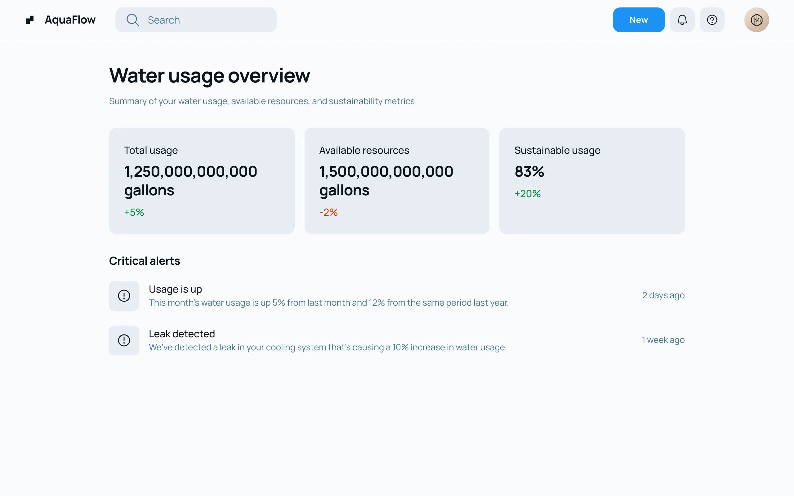
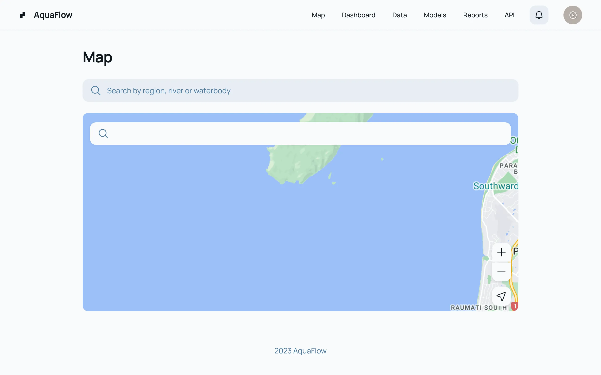
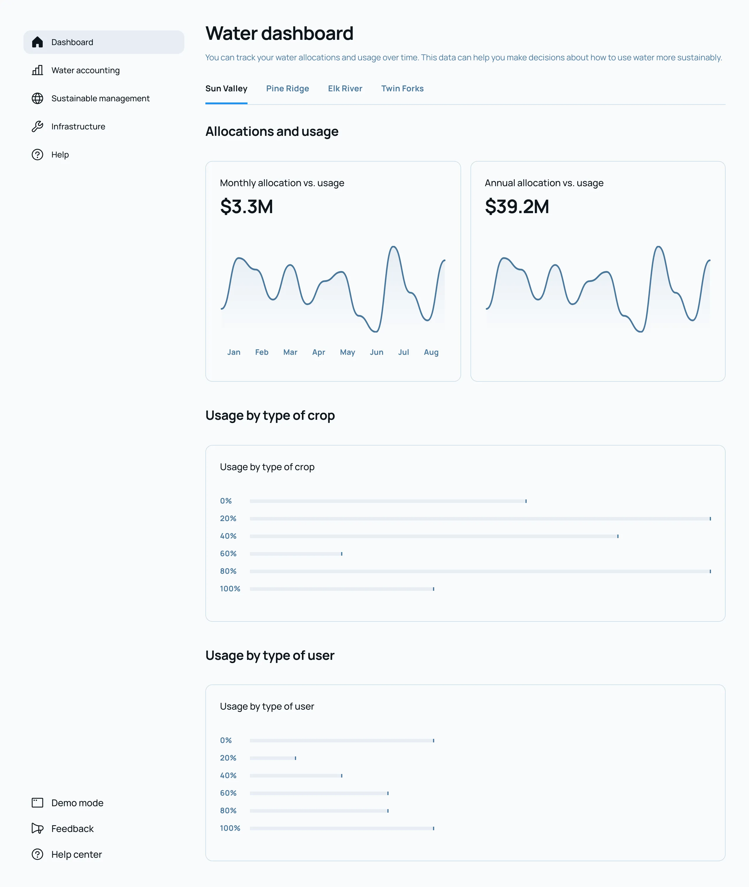
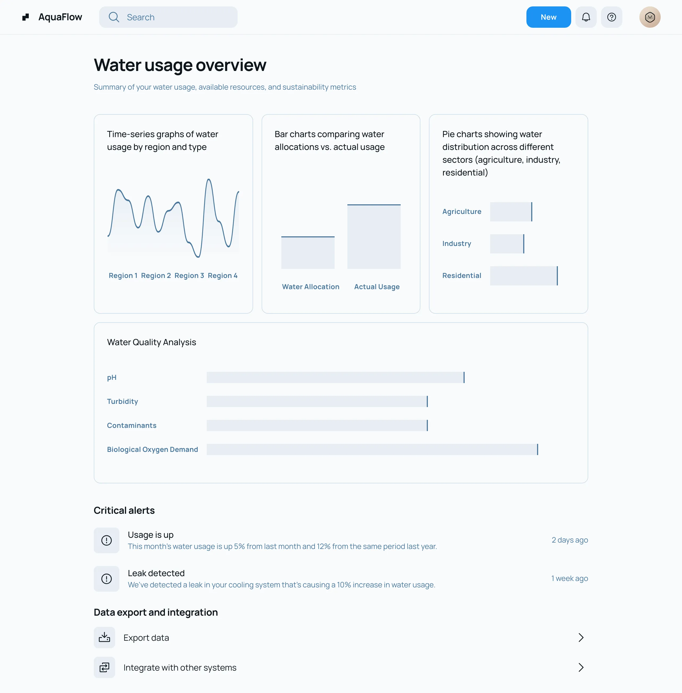
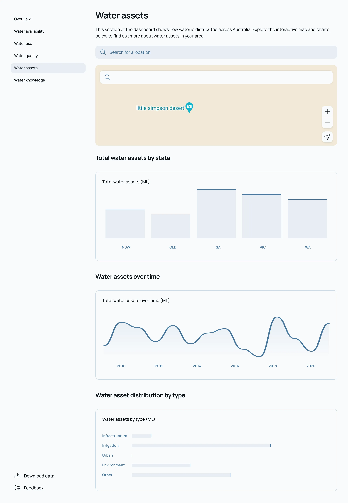
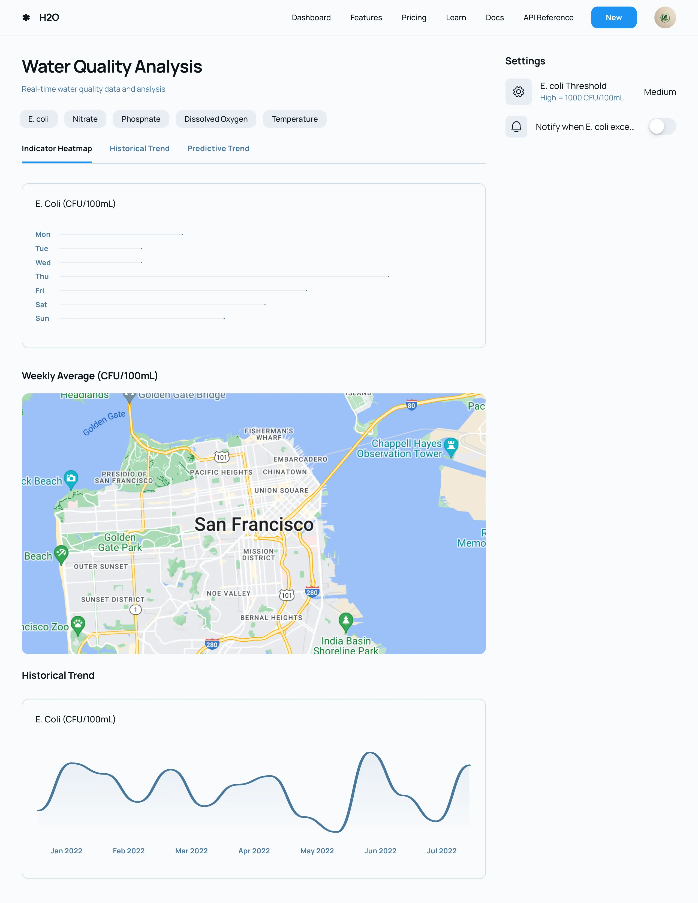
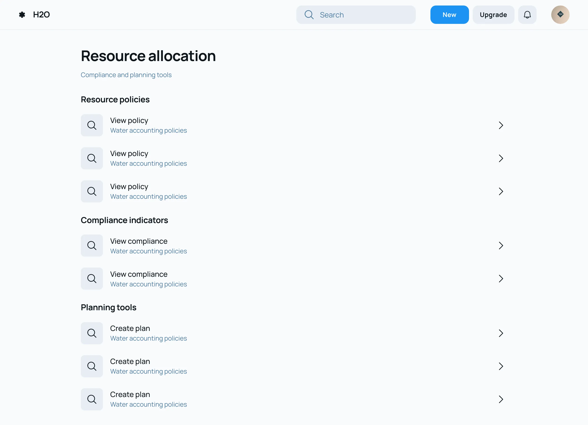
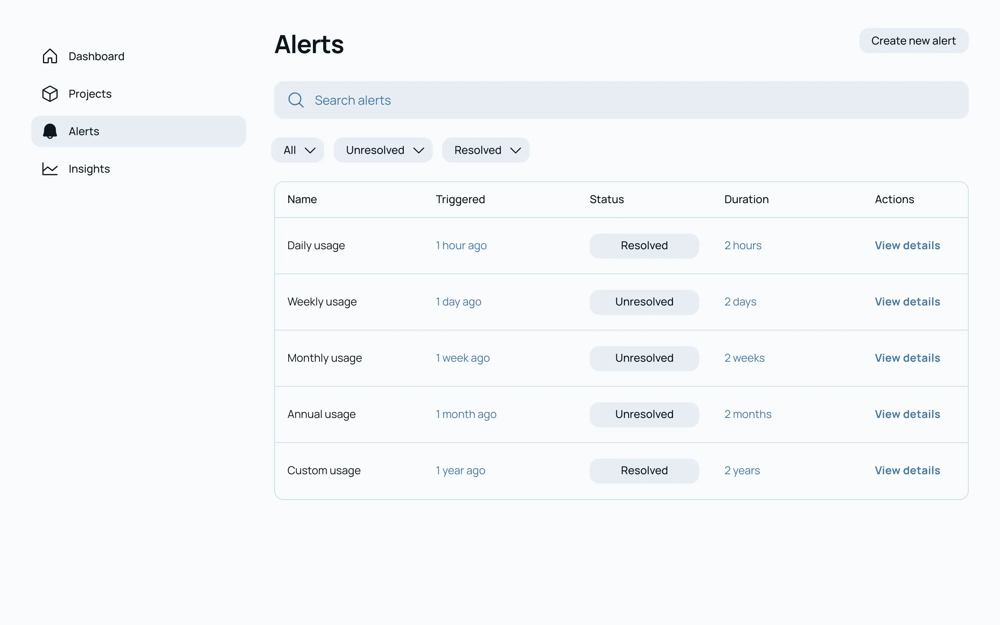

In this blog post, I will be sharing the GUI design that I have created for Water Accounting Project.

# Overview Section with Summary Cards:

This section features an engaging summary with cards that display key metrics such as total water usage, available resources, and critical alerts.

# Interactive NZ Water Map: 

The dashboard includes an interactive map showcasing water bodies across New Zealand with the functionality to display real-time data points.

# Data Visualization Graphs and Charts: 

A comprehensive data visualization section with time-series graphs, bar charts, and pie charts for displaying and comparing water usage trends, including customizable filters.

# Water Quality Analysis Section: 

This part of the dashboard presents quality indicators and visual tools such as heat maps for trend analysis and predictive insights into water quality.

# Resource Allocation Overview: 

Detailed information section on water resource allocation, including policy insights, compliance indicators, and tools for scenario planning.

# Alerts and Reporting Insights: 

A specialized section designed for setting up real-time and customizable alerts, generating automated reports, and providing insights tailored for various stakeholders.

