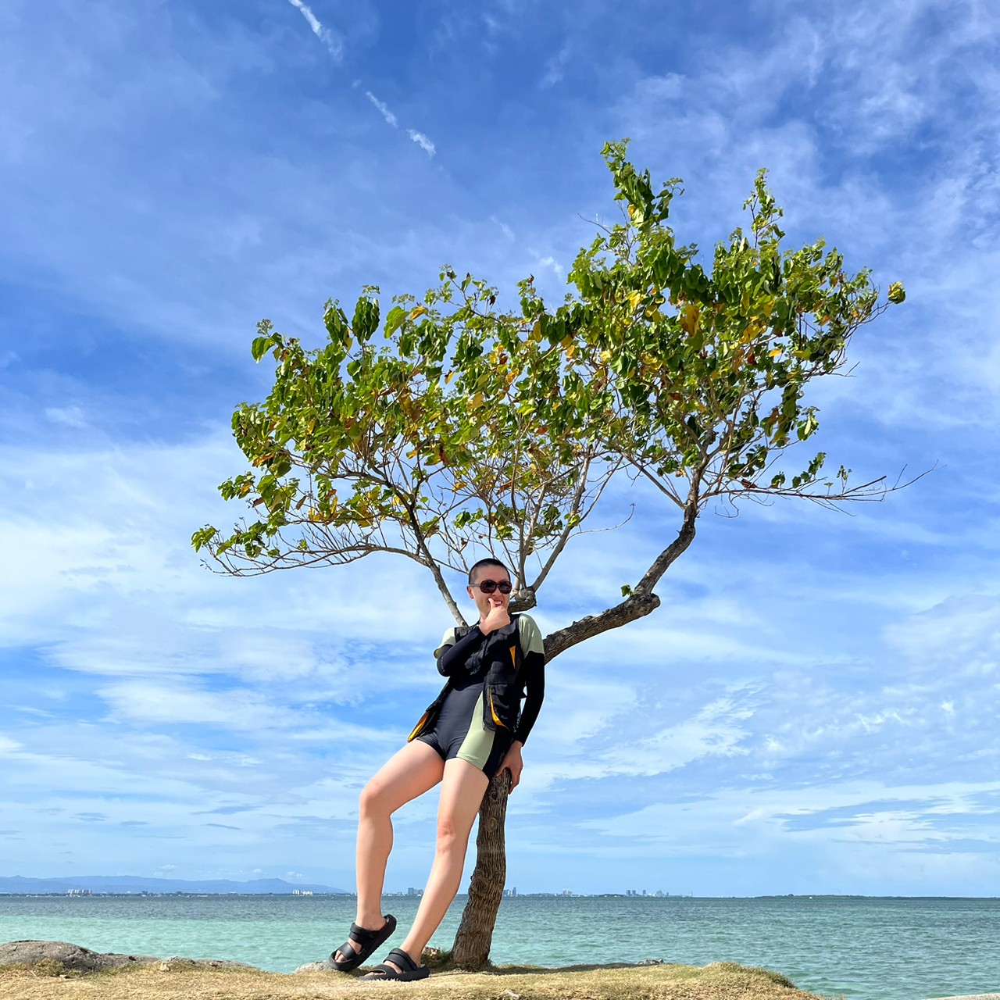

# Personal Appearance Changes

## 2018

During the era of beauty and self-care from head to toe.

## Now

When I stopped being look-anxious, body-anxious, and age-anxious, I saved a lot of time, energy, and money and spent those vital resources on investing in my personal interests and enjoying life.

Freed from various constricting garments, thoroughly enjoying the crew cut.

---

Minimalism has now been internalised as my subconscious and daily habit. The visible and invisible benefits are immense, and it can be said to have completely changed my life.

